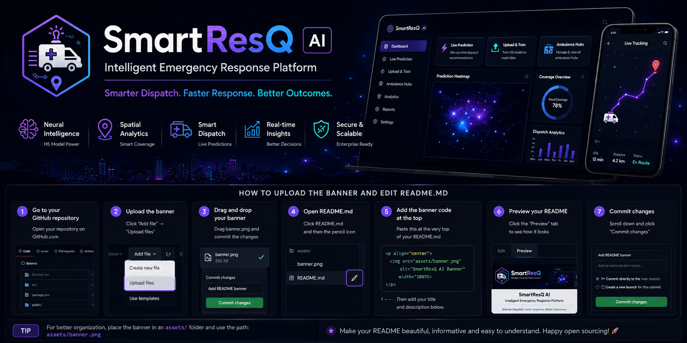

<p align="center">
  
</p>

<h1 align="center">SmartResQ AI</h1>

<h3 align="center">Intelligent Emergency Response Platform</h3>

<p align="center">
Smarter Dispatch. Faster Response. Better Outcomes.
</p>

---

## 🚀 Overview

SmartResQ AI is an AI-powered emergency response platform that leverages Machine Learning and Spatial Intelligence to optimize ambulance positioning, improve emergency coverage, and recommend the nearest dispatch hub in real time.

---

## ✨ Features

- 🧠 Neural Network (H5) based prediction
- 📍 Smart Ambulance Positioning
- 🚑 Real-time Dispatch Recommendation
- 🌍 Spatial Intelligence
- 📊 DBSCAN & GMM Clustering
- ⚡ Interactive Dashboard

---

## 🛠️ Tech Stack

- React
- Vite
- Python
- TensorFlow
- Scikit-Learn
- DBSCAN
- Gaussian Mixture Model
- HTML
- CSS
- JavaScript

---


## ⚙️ Installation

```bash
git clone https://github.com/yourusername/SmartResQ.git

cd SmartResQ

npm install

npm run dev
```

---
